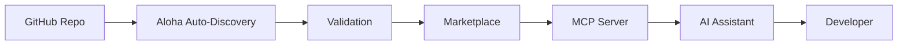

# Introduction

Welcome to **Aloha Docs** - an AI-first documentation marketplace with Model Context Protocol (MCP) server integration.

## What is Aloha Docs?

Aloha Docs is a centralized hub for framework and library documentation that:

- 🔍 **Auto-discovers** documentation from GitHub repositories
- 🤖 **MCP Server** provides AI assistants direct access to your docs
- 🌐 **Marketplace** browse and discover frameworks
- 📦 **Zero Configuration** just push markdown files to GitHub

## Why Aloha Docs?

### For Framework Authors
- **Instant Publishing**: Add your GitHub repo URL and we handle the rest
- **AI-Ready**: Your docs become accessible to Claude, ChatGPT, and other AI tools via MCP
- **Validation**: Built-in documentation quality checks
- **Analytics**: See how developers are using your docs

### For Developers
- **Unified Search**: Search across all frameworks in one place
- **AI Integration**: Ask AI assistants about any framework's documentation
- **Up-to-date**: Always synced with the latest GitHub commits
- **Discovery**: Find new frameworks and tools

## Key Features

### Auto-Discovery System
Simply structure your markdown files in a `docs/` folder and Aloha automatically:
- Discovers all documentation files
- Organizes by folder structure
- Generates navigation
- Validates documentation quality

### MCP Server Integration
Aloha runs a Model Context Protocol server that allows AI assistants to:
- Read documentation in real-time
- Search across all frameworks
- Provide accurate, up-to-date answers
- Route to specific framework docs

### Documentation Standard
A simple, flexible standard that:
- Works with existing markdown
- Requires zero build tools
- Supports component schemas
- Enables rich documentation features

## How It Works

1. **Add Repository**: Provide your GitHub repository URL
2. **Auto-Discovery**: Aloha scans for documentation
3. **Validation**: Ensures docs meet quality standards
4. **Publishing**: Appears in marketplace and MCP server
5. **Access**: Developers and AI can access your docs

## Next Steps

Ready to get started?

- [Installation & Setup](./installation.md) - Set up Aloha Docs locally
- [Quick Start](./quick-start.md) - Add your first framework in 5 minutes
- [Documentation Guide](../guides/documentation-guide.md) - Learn the Aloha standard
